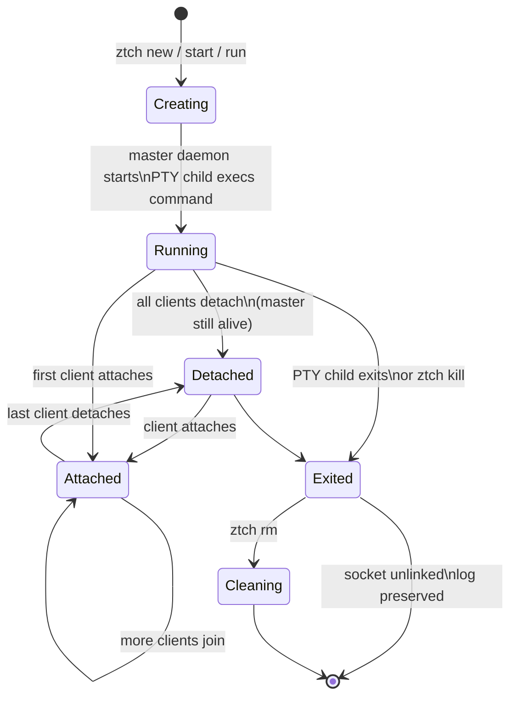
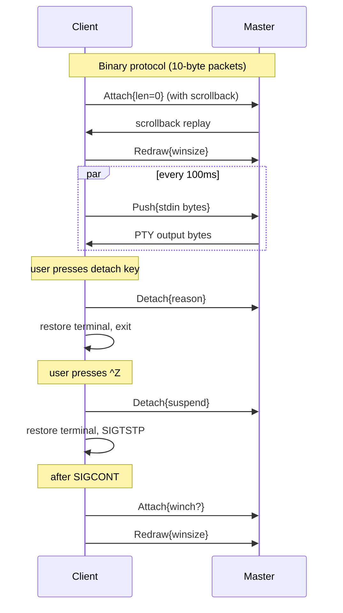
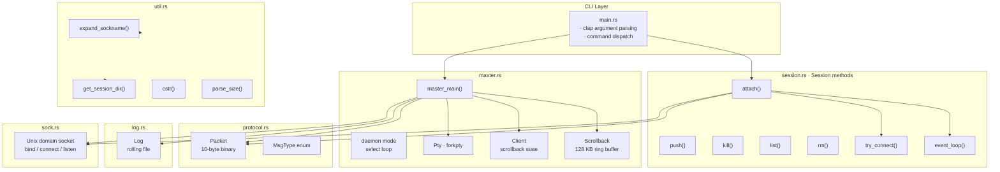
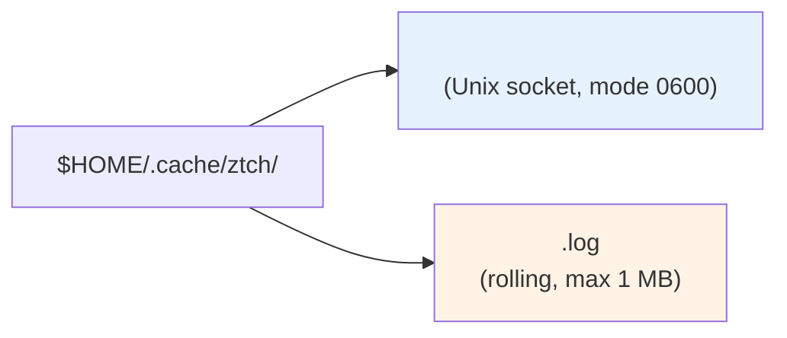

# ztch

**Lineage:** `dtach` → `ztch` (C) → **`ztch`** (Rust)

**ztch** is a lightweight terminal session manager for Linux — a Rust rewrite of [atch](https://github.com/mobydeck/atch), itself a modern take on [dtach](https://github.com/crigler/dtach). It lets you run a command in a background session, detach from it, and reattach later from any terminal.

```
$ ztch new work
$ ztch attach work
$ ztch kill work
```

## Features

- Persistent terminal sessions backed by PTY + background daemon
- Detach and reattach across logins (even over SSH)
- Multiple simultaneous clients attached to one session
- Scrollback replay for late-joining clients
- Rolling session logs with configurable size cap
- `tail -f`-style log viewing (zero-CPU via `inotify`)
- Pipe stdin into a running session via `push`
- Graceful session termination (SIGTERM → SIGKILL)
- Cleanup commands for stale sockets and orphaned logs
- Zero runtime dependencies beyond `libc` and `clap`

## Installation

```bash
cargo install --path .
```

Or build a statically-linked musl binary for deployment:

```bash
cargo build --release --target aarch64-unknown-linux-musl
```

## Quick Start

```bash
# Create a session and attach
ztch new mysession

# Detach: Ctrl-\  (default detach key)

# Reattach later
ztch attach mysession

# List all sessions
ztch list

# Stop a session
ztch kill mysession
```

### Implicit create-or-attach

If you run `ztch <name> [command...]` without a subcommand, it tries to attach; if the session doesn't exist it replays any leftover log, cleans up stale state, and creates a new session:

```bash
# One-shot: attach or create
ztch work vim

# Same, but with explicit command
ztch work tail -f /var/log/syslog
```

## Commands

| Command | Alias | Description |
|---------|-------|-------------|
| `list [-a]` | `l`, `ls` | List sessions |
| `current` | `c` | Show current session name |
| `attach <session>` | `a`, `at` | Strict attach (fail if missing) |
| `new <session> [cmd…]` | `n`, `create` | Create session and attach |
| `start <session> [cmd…]` | `s` | Create session, stay detached |
| `run <session> [cmd…]` | — | Create session, master stays in foreground |
| `push <session>` | `p` | Pipe stdin into a running session |
| `kill <session> [-f]` | `k` | Stop session |
| `clear [session]` | — | Truncate session log |
| `tail <session> [-f] [-n N]` | — | Print last N lines of log (default: 10) |
| `rm [-a] [session]` | — | Remove stale/exited sessions |

Use `ztch ?` (or `ztch --help` / `-h`) to see all commands and flags.

### Global flags

| Flag | Description | Default |
|------|-------------|---------|
| `-e CHAR` | Detach character (e.g. `^\`, `^c`) | `^\` (0x1c) |
| `-E` | Disable detach character | off |
| `-z` | Disable suspend key (`^Z`) | off |
| `-q` | Suppress messages | off |
| `-t` | Disable ANSI/VT100 assumptions | off |
| `-r METHOD` | Redraw method: `none`, `ctrl_l`, `winch` | auto |
| `-R METHOD` | Clear method: `none`, `move` | auto |
| `-C SIZE` | Log cap (`0` = disable, e.g. `128k`, `4m`) | `1m` |

## Architecture

### Session lifecycle



### Client-to-master protocol



### Internal structure



### Session storage



The executable bit (`S_IXUSR`) on the socket is set when clients are attached — `ztch list` uses this to show `[attached]` status.

## Environment

| Variable | Set by | Purpose |
|----------|--------|---------|
| `ZTCH_SESSION` | master child | Colon-separated chain of session socket paths. Prevents self-attach loops. Name derived from the binary name. |
| `SHELL` | user | Default command when none is given (falls back to `/bin/sh`) |
| `HOME` | user | Session directory root (`~/.cache/ztch/`) |

## Configuration

ztch is entirely command-line driven — no config files. All behaviour is controlled by CLI flags and environment variables.

## Tips & Tricks

**Escape to a shell without detaching.** Press `^Z` (suspend) to get back to your local shell, then `fg` to reattach.

**Change the detach key.** If `^\` is awkward, use `^c` or any printable character:

```bash
ztch -e ^c new mysession
```

**Disable the detach key entirely** for safety-critical sessions:

```bash
ztch -E new mysession
```

**Pipe output into a session.** Great for feeding commands into a running REPL:

```bash
echo "SELECT * FROM users;" | ztch push db
```

**Watch logs in real time:**

```bash
ztch tail mysession -f
```

**Clean up all dead sessions:**

```bash
ztch rm -a
```

**Nested sessions.** The `$ZTCH_SESSION` env var prevents attaching to a session from within itself. Check your nesting depth with `ztch current`.

## Building

```bash
# Debug build
cargo build

# Release build (stripped, LTO)
cargo build --release

# Static musl cross-compile
cargo build --release --target aarch64-unknown-linux-musl
```

### Dependencies

- Rust 2021 edition
- `libc` — raw POSIX syscalls
- `clap` — argument parsing (derive API)

## Testing

```bash
# Rust unit tests
cargo test

# CLI smoke tests
bash tests/cli_tests.sh
bash tests/cli_tests.sh -v         # verbose
bash tests/cli_tests.sh list       # run only 'list' tests
```
